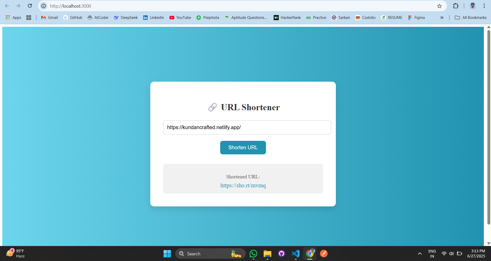

# 22131010923 – Test Submission

This repository contains my submission for the **Afford Medical Technologies** hiring process under the **Frontend Development** track.  
 **Frontend Project** are included in this single folder.

---

## 📁 Contents

- 🌐 Frontend React App – URL Shortener built with Vite + React

---
## 🖼️ Screenshot



### Example Use in Express:
```js
const express = require('express');
const app = express();
const logger = require('./loggingMiddleware');

app.use(logger);
